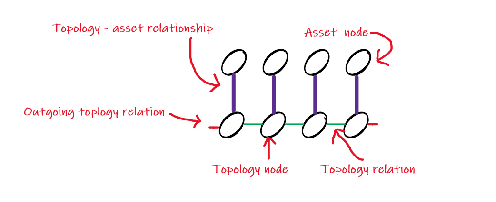
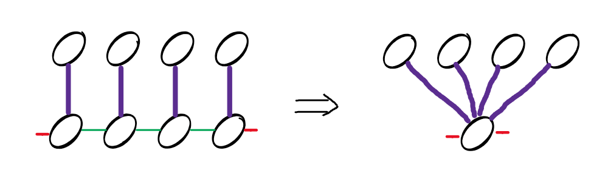
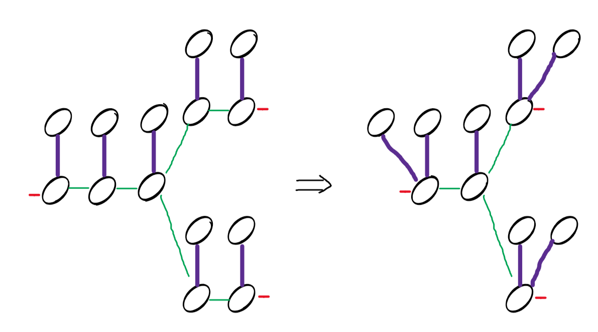
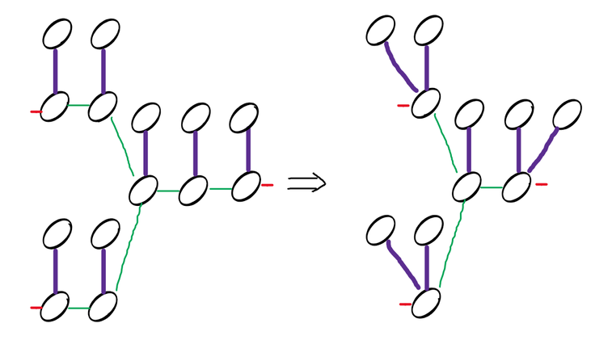

# Read Me First
### Introduction
This project is a test project for the connectivity registry team. 
The goal is to get to know you better as a developer, how you write your code and what your approach to writing algoritms is.
Additionally, it is a good check for you whether you would like to work in our team.

What we value & some tips:
* Quality over quantity
* DRY, SOLID, readable code
* Optimized algorithms
* Tests tests tests!

Please make a pull request when you are done. Try to timebox this to 1.5 hours, pseudocode is also acceptable.
Good luck!

### Assignment 1: Modeling the connectivity
Connectivity is another word for how elements are connected. In the electricity and gas net in the Netherlands, this plays a vital role for:
* Crisis management
* Calculating load on the net
* Planning/modeling future net

The Alliander net is represented by nodes in several layers. For this exercise we will be simplifying the model to two layers:

The connectivity is represented as a graph with nodes and relationships. 

Nodes have:
* an ID which is represented as a Long
* 0...N Relationships of any type (label)
* a label indicating what kind of node it is:  
  * If it is a topology node, it will always have the label "topology"
  * If it is an asset node, it will have one of the following labels: "veld", "rail", "kabel", "transformator"

A relationship describes the relation between nodes, it has the following properties:
* an ID which is represented as a Long
* a label, indicating the type of relationship, between topology nodes it is: "CONNECTS_TOPLOGY", between a topology node and an asset node it is "DESCRIBES_ASSET".
* this relation is present on both nodes of the relationship.

<strong>Assignment 1: </strong>
Create a data structure that can represent the connectivity as pictured above.

### Assignment 2: Container densify
To fulfill the wishes of each of our stakeholders, we need to be capable of offering different views on the topology. We do this by densifying the topology as shown in the picture below:

We call this a recipe, as there are many ways you can perform a densify. 
The recipe for this densify we call a "Container-Recipe".

<strong>Assignment 2:</strong>
Create a Recipe class that will densify a collection of nodes to a container
* The input for the densify method is a collection of nodes
* The output of the densify method:
  * a collection of densified nodes, containing both the "container" node, and the asset nodes pointing towards the container node.
* The container node should have the label "container"
* The container node should have outgoing relationships
  * The outgoing relationship should have the same ID as the last relationship of the original node (indicated in red in the images)

### Assignment 3: Split Container densify  
Another form of densification is the Split Container recipe. In this recipe, containers are made, until there is a split in the graph. 
If this split is reached, stop the container, create a single topology node connected to its assets, and the start 2...N containers after this split node.

<strong>Assignment 3:</strong>
Create a Recipe class that will densify a collection of nodes to a split container:
* The input for the densify method is a collection of nodes
* The output of the densify method:
  * a collection of densified nodes, containing:
    * the "container" node, and the asset nodes pointing towards the container node.
    * the "split" node, and the asset nodes pointing towards this split node
* If there is no split in the graph, it behaves the same as a normal container
* All topology nodes with their assets that are not part of the split, are handled as a container recipe
* The split node is always one topology node with its original connected asset nodes, it should have the same ID's as the input graph
* The split node has the label "split"  
* The relations between the split node on the topology layer, and the container nodes on the topology layer, have the same ID as the relations from the input graph
* Outgoing relations are handled the same as for the Container Recipe

